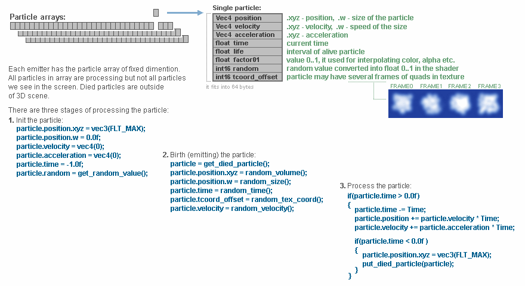

# GpuGalactica

Hello!

This demo exhibits GPU computing technology.

It is the Visual Studio solution of C++ project.

The project code generates particles and simulates a galaxy view.

Now the project uses DirectX technology.

Realized: Direct compute 11, Direct3D 11, OpenCL.
Future plans: cuda, Vulkan.

Tested:
  nVidia GeForce 580 GTX, GeForce 650M GT, GeForce 1070,
  AMD Radeon RX 570,
  Intel HD Graphics 500

You need: Windows 7 or later, VisualStudio 2017 C++, Windows SDK 10.0.15063.

Brief explanation how it works:

We store the indices of died particles in special array.

